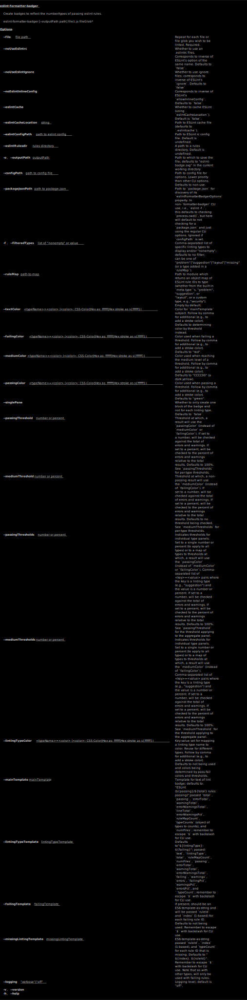

[](https://www.npmjs.com/package/eslint-formatter-badger)
[](https://david-dm.org/brettz9/eslint-formatter-badger)
[](https://david-dm.org/brettz9/eslint-formatter-badger?type=dev)

[](badges/eslint-badge.svg)

<!--[](https://github.com/brettz9/eslint-formatter-badger/actions)-->
[](badges/tests-badge.svg)
[](badges/coverage-badge.svg)
<!--
[](https://github.com/brettz9/eslint-formatter-badger/actions)
-->

[](https://snyk.io/test/github/brettz9/eslint-formatter-badger)
[](https://lgtm.com/projects/g/brettz9/eslint-formatter-badger/alerts)
[](https://lgtm.com/projects/g/brettz9/eslint-formatter-badger/context:javascript)

<!--[](LICENSE-MIT.txt)-->
[](badges/licenses-badge.svg)

(see also [licenses for dev. deps.](https://raw.githubusercontent.com/brettz9/eslint-formatter-badger/master/badges/licenses-badge-dev.svg?sanitize=true))

[](https://issuehunt.io/r/brettz9/eslint-formatter-badger)

# eslint-formatter-badger

Create badges to reflect the number/types of failing or passing eslint rules.

## Installation

```sh
npm i eslint-formatter-badger
```

## Usage

```sh
eslint -f badger .
```

Or, to get use of full options, use the CLI interface.

## API

The programmatic API.

### Default export

`badgerDefault(resultsArray, {rulesMeta: <object>}, options) => ""`

This method is needed as the default so as to work when called by `eslint -f`.

However, the named exports `badger` or `badgerEngine` are to be
preferred for regular progrmmatic usage (or use our CLI) as the
ESLint formatting API forces us to adhere to these limitations:

1. Return an (empty) string rather than a Promise (otherwise ESLint
    will print "Promise"), and as such, if used programmatically, the
    caller wouldn't be notified when the formatting is complete.
1. The formatter adheres to the multiple argument signature, and
    though we pass on `options` if this is called programmatically,
    ESLint does not pass in any third argument, so for `eslint -f`
    usage, we default to checking for any options in the
    `eslintFormatterBadgerOptions` property of the current working
    directory's `package.json`.

#### Arguments

For the structure of the `resultsArray`, see <https://eslint.org/docs/developer-guide/working-with-custom-formatters#the-results-object>
and for the structure of the messages within that object, see <https://eslint.org/docs/developer-guide/working-with-custom-formatters#the-message-object>.

For the structure of the `rulesMeta` object, see <https://eslint.org/docs/developer-guide/working-with-custom-formatters#the-data-argument>.

For `options`, see `badger` below.

### Named export `badger`

`badger({results, rulesMeta, ...options})`

For the structure of the `rulesMeta` object, see <https://eslint.org/docs/developer-guide/working-with-custom-formatters#the-data-argument>.

Note that in programmatic usage (not `eslint -f`), a meta `Map` as passed
in by [`cli.getRules()`](https://eslint.org/docs/developer-guide/nodejs-api#cliengine-getrules)
(and as used by our `badgerEngine`) can be used in addition to the
structure detailed at <https://eslint.org/docs/developer-guide/working-with-custom-formatters#the-data-argument>.

The other options are the same as those detailed in the CLI.

### Named export `badgerEngine`

`badgerEngine(options)`

This is what is used by the CLI. See the CLI for the available options.

However, as a programmatic API, a few more type options are possible:

1. `textColor` may be an array as well as a comma-separated string.
1. For `ruleMap`, an object may be provided in place of a string
    pointing to a module.

## CLI



## Usage example with `es-file-traverse`

When we do not wish to lint all of `node_modules` nor do we need to lint
entire project dependencies, we can use `es-file-traverse` to lint just
those files which are actually in use in our project.

It can be particularly useful to make badges advertising the degree
to which we have looked out for weaknesses in the third-party code we
are using.

(Although any ESLint-based linting still depends on good faith (i.e., it is
possible for dependencies to work around checks), one can still perform
useful audits of the dependencies of one's project to catch problems of
importance, such as finding code which introduces vulnerabilities or
which is intrusive in polluting with globals, etc. (These tend to be more
of the type of problems which third parties may be more willing to fix,
as they are not mere stylistic concerns.))

Here is an example of `eslint-formatter-badger` used to build our own
third-party linting badge for `es-file-traverse`:

```sh
eslint-formatter-badger --mainTemplate=\"ESLint 3rd party light audit (\\${ruleMapCount} rules)\" --filteredTypes intrusive,vulnerability --ruleMap .eslintRuleTypeMap.json --outputPath badges/eslint-3rdparty.svg --noEslintInlineConfig --noUseEslintIgnore --noUseEslintrc --eslintConfigPath .eslintrc-3rdparty.js `es-file-traverse --file ./bin/cli.js --node --cjs`
```

The particular arguments which may be of interest:

- `--mainTemplate` - We override the main badge content here to highlight not
    the total of linting rules available but the total in our custom `ruleMap`
    (i.e., `ruleMapCount`), which we use to indicate the number of applicable
    rules.
- `--ruleMap` - Rather than relying on the default of `meta.type` to
    determine rule type, we map rules in the targeted file to our own types,
    such as considering `no-eval` as belonging to a "vulnerability" type
    (rather than to the more generic "problem" type). We can then can show
    these types (and a count of their failures) in the badge (using
    `--filteredTypes` to show the rule type(s) of interest).
- `--filteredTypes` - We choose the rule types of interest (in this case,
    "intrusive" and "vulnerability") as used in our rule map (where we
    have mapped the rule names to these types).
- `--noEslintInlineConfig` - 3rd parties may disable rules you wish to check
    or they may reference rules which your config does not include,
    causing linting errors.
- `--noUseEslintIgnore` - Don't apply our own `.eslintignore` to the explicit
    list of third party files we are including.
- `--noUseEslintrc` - We don't want to check the normal hierarchy of `.eslintrc.*`
    files, as these are used by our and other projects' for their stylstic
    concerns. We instead use `--config` to indicate the rules we wish to
    be applied.
- `--eslintConfigPath` - Indicates the actual rules we want applied to third party
    files discovered to be used by, or by the dependencies of, the `--file`
    file passed to `es-file-traverse`.
- (The code in backticks, i.e., beginning `es-file-traverse...`) - This
    builds a list of files to pass to ESLint, i.e., only those files which
    are actually used (whether a dependency or our own), in this case,
    starting with the file `./bin/cli.js`.

## See also

- [filesize-badger](https://github.com/brettz9/filesize-badger) - Locally created
    badges indicating file size (also buildable as part of Rollup routine)
- [mocha-badge-generator](https://github.com/ianpogi5/mocha-badge-generator) - Locally
    created badges for Mocha test results
- [coveradge](https://github.com/brettz9/coveradge) - Locally-created badges
    for nyc/istanbul coverage
- [license-badger](https://github.com/brettz9/license-badger) - Locally-created
    badges indicating license types (by degree of permissiveness) used
    within or required by the project.

## To-dos

1. When privileges (or [es-file-traverse](https://github.com/brettz9/es-file-traverse))
    project is ready, document idea of listing linting of dependencies per
    [eslint-plugin-privileges](https://github.com/brettz9/eslint-plugin-privileges)
    ideas (currently an incomplete project), providing some security
    or at least best practices assurances (ideally showcase by linting own
    dependencies and showing as an extra badge in this README)
    1. Provide a useful optional built-in config map based on security
        (e.g., `"no-eval": "vulernable", "no-global-assign": "intrusive"`)
1. Option to pass on to another reporter (so don't need to add
    [eslint-multiplexer](https://github.com/pimlie/eslint-multiplexer)
    or [eslint-formatter-multiple](https://github.com/halkeye/eslint-formatter-multiple)
    in all cases. Could default to `spec` while allowing empty string
    if someone really didn't want any visuals.
1. See about getting tooltips into `badge-up` if external SVG allows; so can
    list all linting rules per section (also add to license-badger showing
    relevant npm packages per license type, and possibly the test names for
    failing Mocha tests in `mocha-badge-reporter`)
